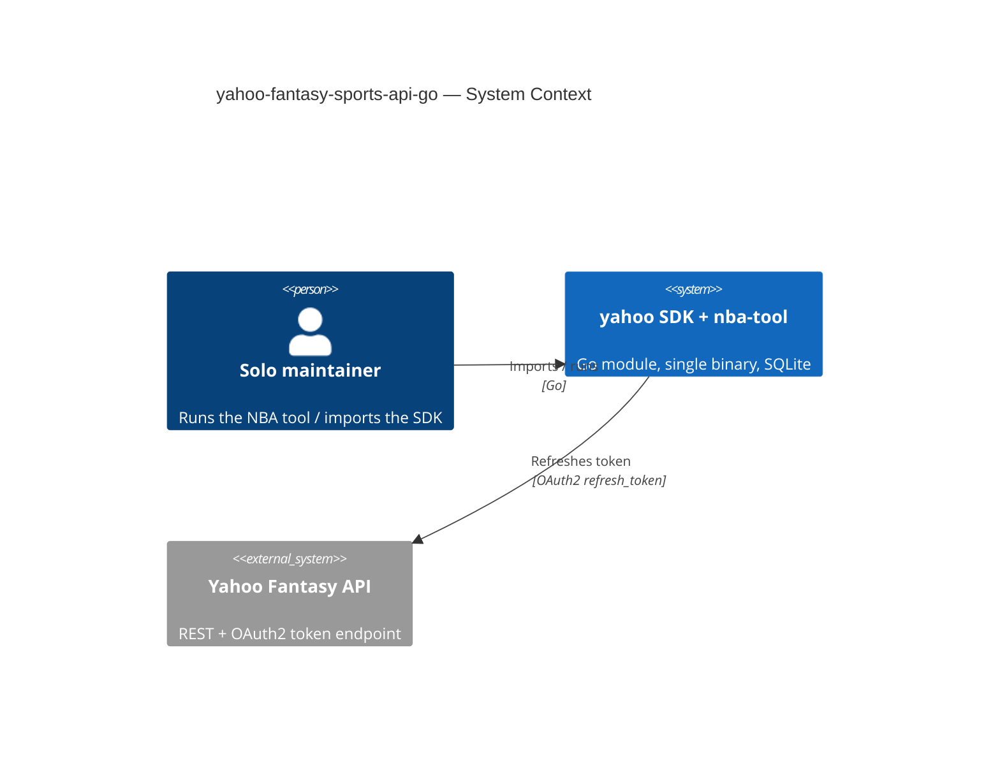
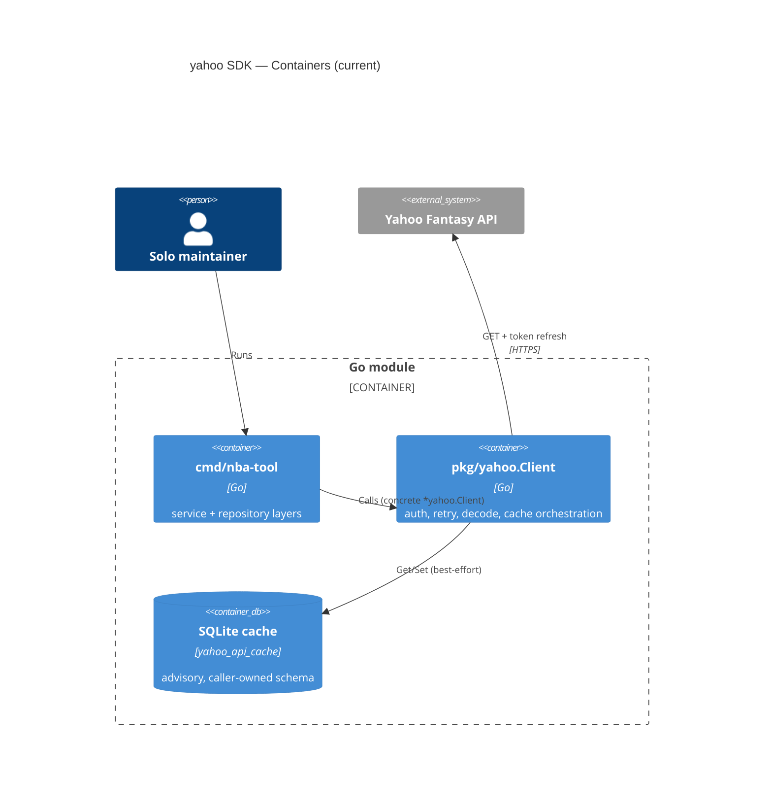

# Assessment 0002: yahoo-fantasy-sports-api-go v2.2.1

## Executive summary

The v1 to v2 hardening worked. This is a boring, well-factored, single-binary
Go SDK with an honest cache-is-advisory design, single-flight token refresh, and
a clean SDK/app import boundary that CI actually enforces. It is safe to depend
on today.

Against the external review: its findings are **factually accurate** — I
confirmed all of them at the code level — but most are severity-inflated for a
**solo, mostly read-only** project. Three are genuine defects worth a solo
maintainer's afternoon (`FromEnv` base-URL precedence, `DecodeWarning` JSON
round-trip, `Roster.TeamID` phantom field). A handful more are cheap
correctness/honesty fixes. The rest — `Page[T]` metadata, `TokenPersistencePolicy`
modes, proactive refresh, PKCE, correlation-ID `APIError`, a fixture corpus — are
SaaS-grade gold-plating this project should **decline on purpose** and write down
why.

Verdict: **8/10 as a pinned personal dependency.** Fix the three real bugs, make
two honesty edits to the docs, and stop there until real usage forces more.

---

## Verification of the external review (file:line + verdict)

Severity columns are **solo-maintainer** severity, not the review's SaaS framing.

| # | Claim | Verdict | Evidence | Solo severity |
|---|-------|---------|----------|---------------|
| 1 | `FromEnv` overrides an explicit `WithBaseURL` | **CONFIRMED** | `options.go:221-223` sets `c.baseURL = v` unconditionally; credentials/tokens above it (209-220) guard with `== ""`, base URL does not. GoDoc `options.go:86-87` claims "take precedence over FromEnv regardless of order." | **Medium** |
| 2 | `DecodeWarning.Err` breaks JSON cache round-trip | **CONFIRMED** | `decode.go:14-18` — `Err error`, no json tag. Empirically: marshal emits `"Err":{"Func":"Atoi",...,"Err":{}}`, unmarshal returns `json: cannot unmarshal object into ... type error`. Embedded in every model via `decode_warnings,omitempty` (e.g. `stats.go:42`). Clean data is fine (omitempty); **malformed** data → `cacheGet` fails at `client.go:553` → silent miss → refetch. | **Medium** |
| 3 | Token `Save` best-effort + uses request ctx; refresh unvalidated | **CONFIRMED** | `client.go:266` `Save(ctx, tok)` uses the request ctx; failure only logged (267). `doRefresh` sets `c.accessToken = tokenResp.AccessToken` (318) with no empty-check and no `expires_in > 0` check (326). | **Low-medium** |
| 4 | Transport errors not retried; Retry-After uncapped; bodies not drained | **CONFIRMED** | `client.go:348-351` returns immediately on `Do` error. `client.go:374-376` assigns `delay = ra` with no cap vs `MaxBackoff` (`retryAfterDelay` at `retry.go:83-101` returns raw seconds). Retry path closes body (379) without draining. | **Low** |
| 5 | Constructor validation incomplete; misleading token error | **CONFIRMED** | `WithBaseURL` only non-empty (`options.go:122-124`), no `url.Parse`. No access-token check at `NewClient` (`options.go:233-265`); deferred to `makeRequest:333-334` with a message naming `YAHOO_ACCESS_TOKEN` even when tokens came from `WithTokens`. | **Low** |
| 6 | No initial OAuth flow; "feature parity" overclaims | **CONFIRMED (docs)** | `README.md:13` and `:601` claim "complete feature parity"; SDK is read-only, no authorize/callback/PKCE. | **Low (honesty)** |
| 7a | `Roster.TeamID` never populated | **CONFIRMED** | Field declared `client.go:77`; `fetchRoster` builds `Roster{}` at `client.go:492-499` and never sets `TeamID` — always `""`. `teamKey` is in scope (472). | **Medium** |
| 7b | `classifySlot` unknown/empty → starting | **CONFIRMED** | `client.go:91-99` — `default: return SlotStarting`; empty `""` and any new Yahoo slot fall through to starting. `IsStarting = slot == SlotStarting` (498). | **Low-medium** |
| 7c | `APIError` lacks parsed code/headers/retryable | **CONFIRMED** | `client.go:188-196` — only `StatusCode/Endpoint/Body`. | **Skip (gold-plating)** |
| 7d | `fetchLeagues` uses silent `fmt.Sscanf` for season | **CONFIRMED** | `client.go:419` `fmt.Sscanf(l.Season, "%d", &season)` — return + error discarded; inconsistent with the `decoder` used everywhere else. | **Low** |
| 7e | `makeRequest` accepts only 200, not 2xx | **CONFIRMED** | `client.go:387` `!= http.StatusOK`. In practice these GETs only ever return 200; comment at `client.go:186` says "non-2xx." | **Trivial (doc)** |
| 7f | 401 refresh keys on body containing `"token_expired"` | **CONFIRMED** | `client.go:358` `strings.Contains(string(body), "token_expired")`. | **Low** |
| 8 | `GameKey` hits network for invalid sport codes; `parseGameKey` picks arbitrary map entry | **CONFIRMED** | `games.go:74` falls through on **any** `GetGameKey` error (bad code or bad season). `parseGameKey` ranges a Go map (`games.go:117`) and returns the first non-`count` entry without verifying code/season. | **Low** |
| 9 | Pagination returns bare slices, no metadata/iterator; players uses raw int | **CONFIRMED** | `pagination.go` is `Start/Count` only; `GetLeaguePlayers(...start, count int)` at `client.go:570` never adopted `PageOptions`. | **Low (mostly skip)** |
| 10 | Cache errors swallowed with no logger signal | **CONFIRMED** | `cacheGet` `client.go:549` drops `err`; `cacheSet` `client.go:566` `_ = c.cache.Set(...)`; expired-row delete ignored `client.go:523`. No version prefix on payloads. | **Low** |
| 11 | Brittle nested-struct decoding, no fixture corpus | **CONFIRMED (partial)** | Rigid response structs (e.g. `client.go:102-172`). Real risk, but a fixture corpus is a large ongoing burden. | **Low (skip the corpus)** |
| 12 | `go 1.25.0` minimum is unjustified | **CONFIRMED** | `go.mod:3`. Only "new-ish" stdlib in use is `math/rand/v2` (`retry.go:6`), which is **go 1.22**. No 1.23/1.24/1.25 feature found (no `WaitGroup.Go`, `synctest`, `os.Root`, `context.WithoutCancel`). | **Low** |
| 13 | CI missing matrix/staticcheck/govulncheck/gofmt/pin | **CONFIRMED** | `.github/workflows/ci.yml` runs vet + import-direction + build + `test -race -cover`. Solid baseline; extras absent. | **Low** |
| 14 | Schema defined inline in tests, no checked-in migration | **CONFIRMED** | `WithSQLiteCache` doc (`options.go:154`) makes the caller own the `yahoo_api_cache` schema. | **Low** |

**Where I disagree with the review's severities:** it rates 3, 4, 9, 11 as
Medium/Medium-high because it imagines an unattended multi-user service. For a
solo, read-only tool the blast radius is: an occasional extra refetch, a
manual restart, or a wrong "starter" flag you'll notice by eye. That reframes
most Mediums to Low. Only 1, 2, and 7a survive as things that will actually bite
future-you silently.

---

## C4 context

## C4 container

The boundary that matters — SDK never importing the app — is real and
CI-guarded (`ci.yml` import-direction step). The app couples to the concrete
`*yahoo.Client` (`league_service.go:30`) rather than a local interface; for a
solo project that is **fine** and I would not add an interface until a second
consumer or a fake for tests actually demands it.

---

## Findings by severity

### Major (fix these — silent and permanent)

- **`FromEnv` base-URL precedence contradicts its own doc (opt #1).** The failure
  is order-dependent and invisible: `WithBaseURL(test)` then `FromEnv()` with
  `YAHOO_BASE_URL` set in the shell silently points every request at the wrong
  host. Effort **S**.
- **`DecodeWarning` is not JSON-stable (opt #2).** Precisely when Yahoo sends
  garbage numerics, the cache silently degrades to a pass-through for that entry
  and you get *zero* signal (the warning that was supposed to be your signal is
  what breaks the round-trip). Effort **S**.
- **`Roster.TeamID` is a phantom field (opt #7a).** A typed field that is always
  `""` is a trap — future-you will read it, trust it, and debug the wrong thing.
  Effort **S**.

### Minor (cheap correctness/honesty; batch them)

- **`classifySlot` empty/unknown → starting (7b).** Change the default to a new
  `SlotUnknown` and treat `""` as unknown, not active. Effort **S**.
- **Season parsing inconsistency (7d).** Route `fetchLeagues` season through the
  same `decoder` used everywhere else so a bad season is observable. Effort **S**.
- **Refresh doesn't validate the new token (opt #3).** Reject an empty
  `access_token` or non-positive `expires_in` in `doRefresh` before committing —
  three lines that prevent a silent lock-into-a-bad-state. Effort **S**.
- **Misleading missing-token error (opt #5).** `makeRequest:334` should not name
  an env var when tokens may have come from `WithTokens`. Effort **S**.
- **"complete feature parity" overclaim (opt #6).** One-sentence README edit:
  "read-only; no write/OAuth-onboarding endpoints." Effort **S**.
- **Cache errors are fully silent (opt #10).** One `logger.Printf` in the
  `cacheGet` error branch turns a whole class of "why is it slow / always
  refetching" mysteries into a log line. Effort **S**.

### Trivial / defensible-as-is

- Transport-error retry, Retry-After cap, body drain (opt #4): the uncapped
  sleep is at least `ctx`-cancellable (`sleepCtx`), and a single un-retried
  transport blip is a re-run for a solo tool. Capping Retry-After at `MaxBackoff`
  is a one-liner worth doing *if* you touch retry.go anyway; the rest is skip.
- `GameKey` fall-through (opt #8): guard with "only go to network if the error is
  a season miss, not a bad sport code" — nice, low priority. The static map
  already covers 2001-2025 for all four sports.
- `go 1.25.0` (opt #12): drop to `go 1.23` (or 1.22, since `rand/v2` is the only
  constraint). Widens who can build it at zero cost. Do it next time you touch
  `go.mod`.

---

## What's actually worth your time

**Do now (one afternoon, all effort-S):**
1. `FromEnv` base-URL — guard with a `baseURLExplicit bool` on `config`, same
   pattern already used for credentials/tokens.
2. `DecodeWarning` — replace `Err error` with `Err string` (store `err.Error()`),
   add json tags (`json:"field"`, `json:"value"`, `json:"error,omitempty"`), keep
   `String()`. Smallest fix that makes the cache round-trip total.
3. `Roster.TeamID` — populate it from `teamKey` in `fetchRoster`, or delete the
   field. Populating is more useful; either kills the trap.

**Do opportunistically (batch with the above if the mood strikes):**
`SlotUnknown` + empty-is-unknown; season via `decoder`; refresh token
validation; the misleading-error and README-parity one-liners; a single
`logger.Printf` on cache-get errors; lower `go.mod`; cap Retry-After.

**Explicitly decline (write a one-line "why not" in the v2 roadmap so future-you
doesn't relitigate):**
- `Page[T]` metadata / `IterateX` / `ListAll` — YAGNI until you page something big.
- `TokenPersistencePolicy` modes + detached persistence context — solo restart is
  a manual re-auth, not a fleet outage.
- Proactive/pre-emptive refresh — reactive 401 refresh is simpler and works.
- PKCE / full OAuth onboarding — only if you ever add writes.
- Rich `APIError` (parsed code, headers, request IDs, `Retryable()`) — you read
  these errors with your own eyes, not a dashboard.
- Sanitized live-fixture corpus across sports/scoring/keeper/injury — high,
  *permanent* maintenance cost for a solo repo; the current table-driven tests
  are enough.
- CI matrix / staticcheck / govulncheck / SHA-pinning — `govulncheck` is the only
  one with real payoff; add it as a single non-blocking step if you want, skip
  the rest.

---

## Documentation consolidation

Docs are already in good shape (`/docs/adr` 0001-0006 indexed, roadmap, this
assessment). Two edits, both honesty:

| File | Action | Reason |
|------|--------|--------|
| `README.md:13,601` | Reword | "complete feature parity" → "read-only parity for supported endpoints; no writes/OAuth onboarding" |
| `pkg/yahoo/options.go:86-87` | Reword or fix code | GoDoc says "regardless of order" but base URL isn't order-independent; fixing opt #1 makes the doc true — preferred over weakening the doc |

No new ADR required for the bug fixes (they restore documented behavior). If you
adopt `SlotUnknown`, that's a public-API addition worth a two-line note in
`docs/adr/0004`-adjacent history or a short ADR-0007.

---

## Bottom line

The review is right on the facts and over-worried on the stakes. Fix the three
majors, make the honesty edits, batch the trivials if you're already in the file,
and consciously walk away from the SaaS wishlist. This is a boring dependency in
the best sense — keep it that way.
