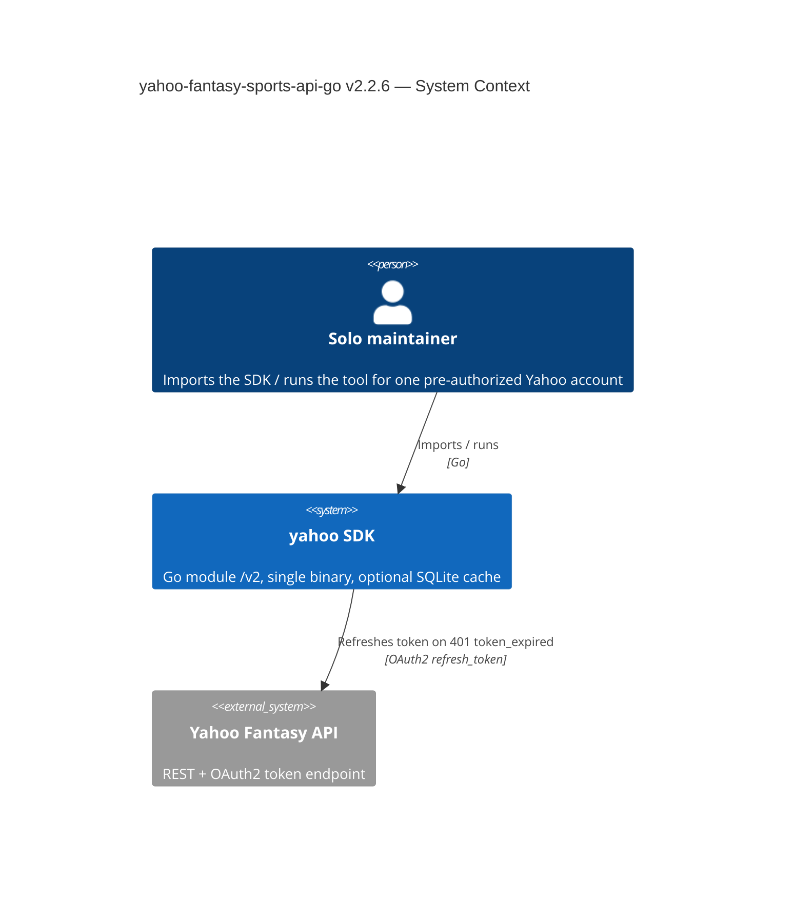
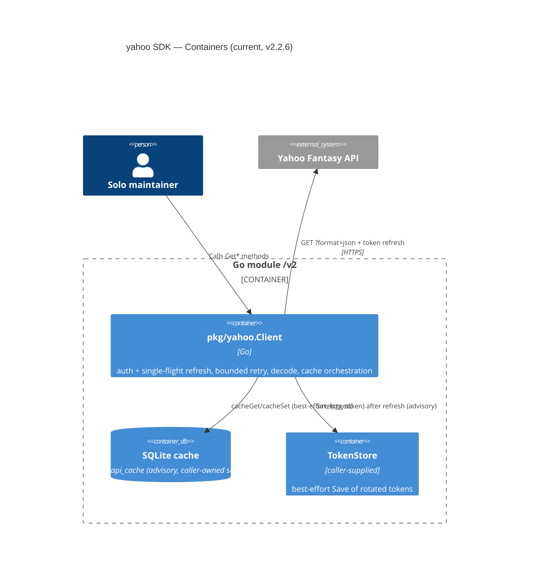
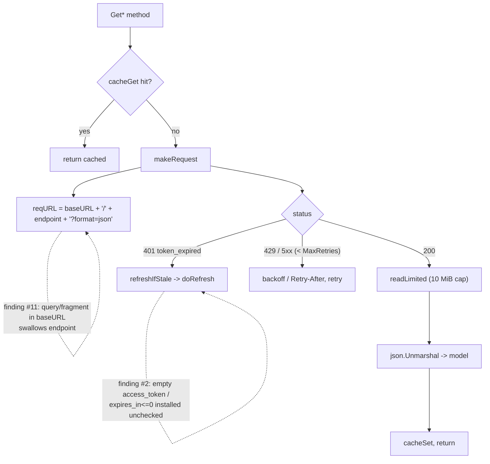

# Assessment 0003: yahoo-fantasy-sports-api-go v2.2.6

## Executive summary

The v2.2.2–v2.2.5 cycle closed every actionable finding from assessment 0002 — I
verified each in code (`DecodeWarning` now round-trips via custom
`MarshalJSON`/`UnmarshalJSON` at `decode.go:38-62`; `Roster.TeamID` is populated
at `client.go:492-495`; `classifySlot` has `SlotUnknown` at `client.go:96-98`;
`FromEnv` guards base URL with `baseURLExplicit` at `options.go:246-250`;
`go.mod:3` is now `go 1.22.0`). This is a boring, well-factored, single-binary
read-only SDK. Safe to depend on.

The external v2.2.6 review is **factually accurate on nearly every point** — I
confirmed 24 of its 26 findings against the code, refuted none outright, and
marked 2 as partial. But it scores 8.0/10 through a *production multi-user SaaS*
lens. Recalibrated for a **solo, pre-authorized, read-only personal tool**, the
blast radius of almost everything it raises is: one extra refetch, one manual
re-run, or a wrong flag you notice by eye. That collapses most of its
Medium/High findings to Low.

Three genuine cheap correctness wins survived recalibration and are worth a solo
afternoon:

1. **Reject base URLs with query/fragment/userinfo** (`options.go:15-30` +
   `client.go:343`) — a real gap in the URL validation added since 0002; a
   misconfigured base URL silently swallows the endpoint into a query string.
2. **Validate the refresh response** (`client.go:324-333`) — an empty
   `access_token` or non-positive `expires_in` is installed without complaint,
   which can wedge the in-memory client into a broken auth state.
3. **Add direct tests for the untested endpoint fetchers** — the core entry
   points (`GetUserLeagues`, `GetLeagueStandings`, `fetchLeagues`, …) sit at
   **0% direct coverage** (verified below). For a solo maintainer this is the
   highest-value item: these are exactly the functions future-you will refactor
   blind.

Everything else the review escalates — `Page[T]` + iterators, required
token-persistence + detached context, rich `APIError`, transport-error retries,
a live-fixture corpus, shipped SQLite migrations, full OAuth onboarding — is
SaaS-grade gold-plating this project should **decline on purpose**. Reasons
recorded below so future-you doesn't relitigate.

Verdict: **9/10 as a pinned personal read-only dependency.** Do the three wins,
make one honesty edit to the README, decline the rest.

---

## Verification of the external review (file:line + verdict)

Severity columns are **solo read-only** severity, not the review's SaaS framing.
"New" = not already tracked in assessment 0002.

| # | Claim | Verdict | Evidence | Solo severity | New? |
|---|-------|---------|----------|---------------|------|
| 1 | Token `Save` best-effort + uses request ctx | **CONFIRMED** | `client.go:271-274` — `Save(ctx, tok)` uses the request ctx; failure only logged. | **Low** | 0002 #3 |
| 2 | Refresh responses unvalidated (accepts `access_token:""`, `expires_in<=0`) | **CONFIRMED** | `client.go:324-333` sets `c.accessToken = tokenResp.AccessToken` with no empty check; `ExpiresAt` computed from `ExpiresIn` with no `>0` guard. | **Medium** | Escalated |
| 3 | Auth-combination not validated at construction | **CONFIRMED** | `NewClient` (`options.go:260-292`) checks httpClient/cache/logger only; never checks `(key=="")!=(secret=="")` or refresh-without-creds. | **Low** | New |
| 4 | Transient transport failures not retried | **CONFIRMED** | `client.go:354-357` returns immediately on `Do` error; retry loop only branches on status. | **Low** | 0002 #4 |
| 5 | Retry-After bypasses `MaxBackoff` | **CONFIRMED** | `client.go:380-383` assigns `delay = ra` unconditionally; `retryAfterDelay` (`retry.go:83-101`) returns raw seconds, uncapped. | **Low** | 0002 #4 |
| 6 | Retry responses not drained before close | **CONFIRMED** | `client.go:385` closes body without draining. | **Trivial** | 0002 #4 |
| 7 | Only HTTP 200 accepted; 204 → `APIError` | **CONFIRMED** | `client.go:393` `!= http.StatusOK`; doc at `client.go:191-193` says "non-2xx". These GETs only ever return 200 in practice. | **Trivial (doc)** | 0002 #7e |
| 8 | Oversized success responses silently truncated | **CONFIRMED** | `readLimited` (`client.go:205-207`) = `io.ReadAll(io.LimitReader(r, 10MiB))`; 1 byte over → exactly 10 MiB, no error, later decode error. | **Low** | New |
| 9 | Error bodies too large/revealing (~10 MiB in `Error()`) | **CONFIRMED** | `APIError.Body` bounded only by the 10 MiB `readLimited`; `Error()` (`client.go:200-202`) prints the whole body. | **Low** | New (0002 #7c adjacent) |
| 10 | `APIError` too thin (no method/code/RetryAfter/RequestID/headers) | **CONFIRMED** | `client.go:194-198` — `StatusCode/Endpoint/Body` only. | **Skip** | 0002 #7c |
| 11 | Base URLs with query/fragment pass validation, break requests | **CONFIRMED** | `validateHTTPURL` (`options.go:15-30`) checks scheme + host but not query/fragment/userinfo; `makeRequest` (`client.go:343`) does `fmt.Sprintf("%s/%s?format=json", baseURL, endpoint)` → endpoint swallowed into the query. | **Medium** | New |
| 12 | No initial OAuth authorization flow | **CONFIRMED** | No authorize URL/callback/state/PKCE anywhere; `WithTokens` (`options.go:124-130`) expects pre-obtained tokens. | **Low (scope)** | 0002 #6 |
| 13 | `parseGameKey` returns first map entry without verifying code/season | **CONFIRMED** | `games.go:122-135` ranges `games` map, returns first non-`count` entry with a non-empty `game_key`; no code/season check; map order nondeterministic. | **Low** | 0002 #8 |
| 14 | Season validation weak (negative falls through to network) | **CONFIRMED** | `GameKey` (`games.go:73-92`): `GetGameKey` errors for an out-of-map season, then falls through to `makeRequest` with `seasons=%d` (negative). | **Low** | New |
| 15 | `classifySlot`: non-empty unknown slot → starting | **CONFIRMED** | `client.go:103` `default: return SlotStarting`; a new Yahoo reserve slot becomes a phantom starter. Empty is now correctly `SlotUnknown` (0002 fix). | **Low** | 0002 #7b (declined part) |
| 16 | `fetchLeagues` still uses silent `fmt.Sscanf` for season | **CONFIRMED** | `client.go:425` `fmt.Sscanf(l.Season, "%d", &season)` — return + error discarded; inconsistent with the `decoder` used elsewhere. | **Low** | 0002 #7d (deferred) |
| 17 | Core endpoint fetchers at 0% direct coverage | **CONFIRMED** | Measured: `GetUserLeagues`, `GetLeagueTeams`, `GetTeamRoster`, `GetLeaguePlayers`, `GetPlayerStats`, `GetLeagueStandings`, `GetLeagueMatchups`, `GetLeagueDraftResults`, `fetchLeagues`, `fetchTeams`, `fetchLeaguePlayers`, `fetchPlayerStats`, `fetchStandings`, `fetchMatchups` all **0.0%**. Package 64.4%. (`fetchRoster` 89.5%, `makeRequest` 88.1% are the covered ones.) | **Medium** | New |
| 18 | Real Yahoo response fixtures missing (synthetic only) | **CONFIRMED** | Tests use inline JSON literals (e.g. `correctness_test.go:25-27`). | **Low (skip corpus)** | 0002 #11 |
| 19 | Pagination lacks completeness metadata | **CONFIRMED** | `pagination.go` is `Start/Count` + `suffix()` only; fetchers return bare slices. | **Low** | 0002 #9 |
| 20 | Pagination APIs inconsistent (players raw int vs `PageOptions`) | **CONFIRMED** | `GetLeaguePlayers(...start, count int)` (`client.go:596`) vs `GetLeagueDraftResultsPage(..., PageOptions)` (`client.go:672`). | **Low** | 0002 #9 |
| 21 | Cache payloads not versioned | **CONFIRMED** | `cacheSet` (`client.go:582-594`) stores raw `json.Marshal(v)`; keys have no schema-version prefix. | **Low** | 0002 #10 |
| 22 | Expired-cache cleanup errors ignored | **CONFIRMED** | `apiCache.Get` (`client.go:537`) `_, _ = c.db.ExecContext(... DELETE ...)`. | **Trivial** | 0002 #10 |
| 23 | SQLite schema ownership external, no shipped migration | **CONFIRMED** | `WithSQLiteCache` doc (`options.go:178-179`) makes the caller own the `yahoo_api_cache` schema. | **Low** | 0002 #14 |
| 24 | Read-oriented, not complete fantasy management | **CONFIRMED (scope)** | No write/lineup/add-drop/trade endpoints exist. | **N/A (by design)** | 0002 #6 |
| 25 | "Complete feature parity" README claim too broad | **CONFIRMED** | `README.md:13` and `README.md:601` still say "complete feature parity with the Python `yahoofantasy` package". The 0002 honesty edit was **not applied**. | **Low (honesty)** | 0002 #6 (still open) |
| 26 | Ecosystem maturity limited | **PARTIAL / N-A** | True in the abstract; for a solo pinned dependency the mitigation ("wrap it, pin it, own your fixtures") is already the operating model. | **Skip** | Strategic |

Two I'd flag as **PARTIAL rather than the review's framing**: #24 and #26 are not
defects at all for this project — they are the deliberate scope (read-only,
personal). Nothing to "fix"; only to state plainly (see #25).

**Where I disagree with the review's severities:** it rates 2, 8, 11, 17 as
Medium/Medium-high and 1, 12 as High because it pictures an unattended
multi-tenant service. For a solo pre-authorized read tool: a truncated 10 MiB
Yahoo response has never happened and would surface as a loud decode error, not
silent corruption; a broken-token refresh is a manual re-auth; missing OAuth
onboarding is a one-time console copy-paste. The two that genuinely bite
future-you *silently* are **#11 (base URL swallows the endpoint with no error)**
and **#2 (a bad refresh response wedges auth with no signal)**; the one that
bites you *when you next change the code* is **#17 (no tests on the core
fetchers)**.

---

## C4 context

## C4 container

The request path is the one place worth seeing end-to-end, because two of the
three real findings live in it:

---

## Findings by severity (solo lens)

### Major — silent and future-you-hostile (do these)

- **Base URL with query/fragment/userinfo passes validation, breaks requests
  (#11).** `validateHTTPURL` (`options.go:15-30`) added scheme + host checks but
  not query/fragment/userinfo, and `makeRequest` string-concatenates
  (`client.go:343`). `WithBaseURL("https://x/base?debug=1")` yields
  `https://x/base?debug=1/league/…?format=json` — the endpoint is gone, no error,
  a confusing 404/decode failure much later. This is the one net-new correctness
  gap in code I added since 0002. Effort **S**.
- **Refresh response is installed unvalidated (#2).** `doRefresh`
  (`client.go:324-333`) commits `tokenResp.AccessToken` even if `""`, and derives
  `ExpiresAt` from `ExpiresIn` even if `<= 0`. A malformed token endpoint reply
  silently wedges the in-memory client; the next request fails the no-token guard
  or 401-loops. Three lines prevent a silent broken-auth state. Effort **S**.
- **Core endpoint fetchers at 0% direct coverage (#17).** Every top-level read
  method except `GetTeamRoster`'s `fetchRoster` is untested against an httptest
  server. For a solo maintainer this is the highest-leverage gap: these are the
  functions you'll refactor a year from now with no safety net, and they each
  have a distinct fragile nested-struct decode (`client.go:108-178`,
  converters). Effort **M** (one table-driven test per fetcher: happy path +
  empty + malformed JSON is enough; skip the cache/cancel/status permutations the
  review lists — `makeRequest` already covers those centrally).

### Minor — cheap correctness/honesty (batch if you're in the file)

- **README "complete feature parity" still overclaims (#25).** `README.md:13` and
  `README.md:601`. The 0002 edit was never applied. One-sentence reword:
  "read-only parity for the supported endpoints; no write or OAuth-onboarding
  flows." Effort **S**. (Carryover — the last open 0002 item.)
- **Oversized response silently truncated (#8).** If a real response ever exceeds
  10 MiB it becomes a baffling decode error. Read `maxResponseBody+1` and return a
  typed `ErrResponseTooLarge` instead. Low odds, cheap clarity. Effort **S**.
- **Auth-combination validation absent (#3).** Reject `(key=="") != (secret=="")`
  and a refresh token without creds at `NewClient` (`options.go:266-277`) — fails
  a mis-wired client at construction instead of on the first 401. Effort **S**.
- **Retry-After uncapped (#5).** `Retry-After: 3600` sleeps an hour despite the
  8 s `MaxBackoff`. It's `ctx`-cancellable, so not dangerous, but capping at
  `MaxBackoff` in `client.go:380-383` is a one-liner worth doing *if* you touch
  retry. Effort **S**.
- **`fetchLeagues` silent `fmt.Sscanf` (#16).** Route the season through the same
  `decoder` used everywhere else so a bad season is observable. Effort **S**.
- **Accept 2xx, not just 200 (#7).** Widen `client.go:393` to `< 200 || >= 300`
  so the code matches its own "non-2xx" doc. Effort **S**.

### Trivial / defensible as-is

- Season `<= 0` guard (#14), `parseGameKey` code/season verification (#13):
  nice-to-haves; the static map already covers 2001–2025 for all four sports, so
  the network path is rarely reached. One-liners if the mood strikes.
- Drain retry bodies (#6), log expired-row delete failures (#22): micro-hygiene,
  no user-visible effect for a solo tool.
- `classifySlot` per-sport allowlist (#15): declined in 0002 as gold-plating;
  still declined. Empty→`SlotUnknown` (the silent case) is already fixed; a
  brand-new Yahoo reserve slot is a rare, eyeball-visible wrong flag.

---

## What's actually worth fixing — two explicit buckets

### (a) Cheap real wins a solo project SHOULD do

| Win | Finding | File:line | Effort | Why it's worth it |
|-----|---------|-----------|--------|-------------------|
| Reject query/fragment/userinfo in base URL | #11 | `options.go:15-30`, `client.go:343` | S | Silent endpoint loss; net-new gap in validation added since 0002 |
| Validate refresh response (non-empty token, `expires_in>0`) | #2 | `client.go:324-333` | S | Prevents silent broken-auth wedge |
| Direct tests for every `fetch*`/`Get*` fetcher | #17 | `client.go` fetchers | M | 0% coverage on the core surface; safety net for future refactors |
| README parity honesty edit | #25 | `README.md:13,601` | S | Last open 0002 item; keeps the claim true |
| Typed oversized-response error | #8 | `client.go:205-207` | S | Turns a future baffling decode error into a clear one |

Optional same-afternoon batch (all S): auth-combo validation (#3), Retry-After
cap (#5), `fetchLeagues` via `decoder` (#16), accept 2xx (#7).

### (b) SaaS gold-plating to DECLINE (and why)

| Declined item | Finding | Why not (solo read-only) |
|---------------|---------|--------------------------|
| `Page[T]` metadata + `ListAll`/iterators | #19 | YAGNI until you actually page something big; you know your league sizes |
| Standardize player pagination onto `PageOptions` | #20 | Cosmetic API churn on a stable read method; not worth a breaking change |
| `PersistenceRequired` policy + detached bounded ctx | #1 | A solo restart is a manual re-auth, not a fleet lockout; request-ctx Save is fine |
| Rich `APIError` (method/code/RequestID/headers/`Retryable()`) | #10 | You read these errors with your eyes, not a dashboard/alerting rule |
| Cap/sanitize error body as a *must* | #9 | No multi-tenant log-leak surface; keep the body, maybe truncate to 64 KiB if trivial |
| Transport-error retries | #4 | A single transport blip is a re-run; classified retry logic is real complexity to own |
| Retry-After cap as a hard requirement | #5 | Already `ctx`-cancellable; do the one-liner, don't build a policy around it |
| Cache payload versioning | #21 | Cache is advisory; a model change causing one noisy refetch is self-healing |
| Ship SQLite migrations / schema version | #23 | Caller owns the DB by design; shipping migrations re-couples the SDK to a store |
| Live-fixture corpus across sports/scoring/keeper | #18 | High, *permanent* maintenance cost; synthetic table-driven tests are enough |
| Full OAuth onboarding (authorize/callback/PKCE) | #12 | One pre-authorized account; onboarding is a one-time console copy-paste |
| "Feature parity" being literally true | #24 | It's read-only by design; fix the *claim* (#25), not the scope |

---

## Recommendations by horizon

**This week (one afternoon, mostly effort-S):**
1. Reject query/fragment/userinfo in `validateHTTPURL` (#11). First step: after
   the host check in `options.go:28`, `if u.RawQuery != "" || u.Fragment != "" ||
   u.User != nil { return error }`. Add a test alongside `TestURLValidation`
   (`correctness_test.go:59`).
2. Validate the refresh response (#2). First step: in `doRefresh` after the
   unmarshal (`client.go:322`), `if tokenResp.AccessToken == "" || tokenResp.ExpiresIn <= 0 { return Token{}, false, fmt.Errorf(...) }`.
3. README parity edit (#25).

**This month:**
4. Add one table-driven test per untested fetcher (#17) — happy + empty +
   malformed against an httptest server, mirroring the existing
   `TestFetchRoster*` tests. First step: copy `hardening_test.go:68-93` as the
   template for `GetLeagueStandings`, then fan out.
5. Batch the optional S-items (#3, #5, #7, #8, #16) if you're already in
   `client.go`/`retry.go`.

**This quarter:** nothing forced. Revisit only if you add write endpoints (then
#12 OAuth onboarding becomes real) or a second consumer (then a local interface
over `*yahoo.Client` earns its keep).

---

## Documentation consolidation

Docs are in good shape (`/docs/adr` 0001–0006 indexed, roadmap, assessments
0001–0003). One honesty edit outstanding plus a note:

| File | Action | Reason |
|------|--------|--------|
| `README.md:13,601` | Reword | "complete feature parity" → "read-only parity for supported endpoints; no writes/OAuth onboarding". Carryover from 0002; still unapplied. |
| `docs/v2-roadmap.md` "Explicit non-goals" | Append | Record the declined bucket (b) above so future-you doesn't relitigate `Page[T]`, persistence policies, rich `APIError`, fixture corpus, OAuth onboarding. |

No new ADR needed for the fixes (#11 and #2 restore intended behavior; the tests
add no surface). If you add `ErrResponseTooLarge` (#8) as an exported sentinel,
note it in the CHANGELOG — it's a public-API addition, not an ADR-level decision.

---

## Bottom line

The external review is right on the facts and over-worried on the stakes — same
conclusion as 0002, one cycle later, and the intervening cycle actually closed
0002's real items. Three cheap wins remain (base-URL rejection, refresh-response
validation, fetcher tests), one honesty edit is still pending (README parity),
and the rest is a SaaS wishlist to walk away from with intent. Do the three, edit
the one, and keep this a boring dependency.
