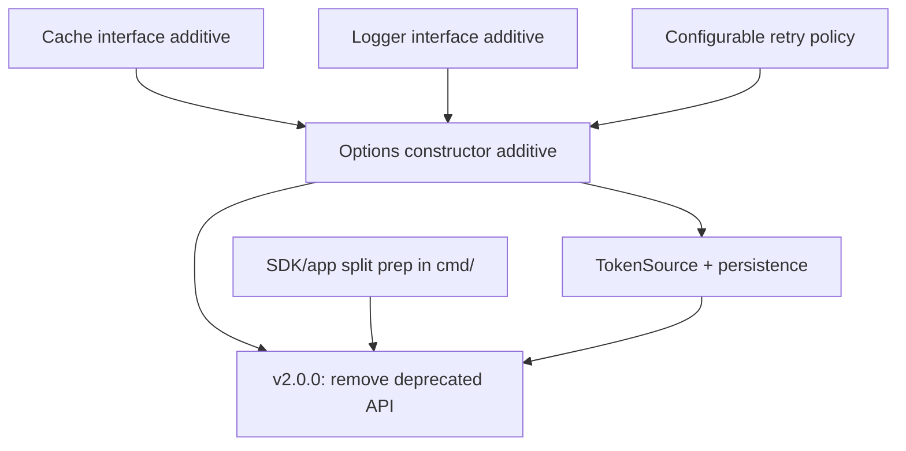

# v2 Roadmap

**Status:** Draft
**Date:** 2026-07-24
**Owner:** Maintainer
**Related:** [ADR-0002](./adr/0002-separate-sdk-from-application.md), [ADR-0003](./adr/0003-options-constructor.md), [assessment 0001](./assessments/0001-maintainable-architect-v4-assessment.md)

## Purpose

Sequence the structural changes from the ADRs into an implementable plan that
reaches a clean `v2` **without a big-bang rewrite**. The guiding principle:
introduce the new surface **additively in `v1.x`** (deprecating the old), so the
actual `v2.0.0` release is mostly *deletions* plus the Go module `/v2` path
change. This keeps every step small, reviewable, and shippable, which is what a
solo maintainer needs.

## What forces a major version

Three changes cannot be made backward-compatibly and therefore define `v2`:

1. **Removing the positional `NewClient(apiKey, apiSecret string, db *sql.DB)`**
   in favor of `NewClient(opts ...Option) (*Client, error)` (ADR-0003). The
   signature changes, so the old name cannot simply be overloaded.
2. **Removing `pkg/service` and `pkg/repository`** from the module's public
   surface (ADR-0002). Their import paths change or they leave the module.
3. **Dropping the `mattn/go-sqlite3` requirement** from the SDK's `go.mod`
   (graph hygiene — note the compiled-dep is already absent for `pkg/yahoo`
   consumers; see ADR-0002 amendment).

Everything else the ADRs describe — options, interfaces, token source, retry
config — can land additively first.

## Go module `/v2` requirement

A `v2` module **must** change its path:

```
module github.com/n-ae/yahoo-fantasy-sports-api-go/v2
```

Consumers import `.../v2/pkg/yahoo` and `go get …/v2@v2.0.0`. The `v1` line
keeps working from the same repository (Go resolves `/v2` from the `v2.x` tags).
Plan to keep `v1` on a maintenance branch for critical fixes for one release
cycle after `v2.0.0`.

## Dependency order



The options constructor (C) is the linchpin: the `Cache`, `Logger`, retry, and
`TokenSource` seams all attach to it. The SDK/app split (F) is independent prep
that only *lands* at the `v2` cut.

## Phases

### Phase A — `v1.7.0` (minor, additive): the options constructor and seams

Introduce the new construction surface alongside the old one.

- Add `type Option func(*config) error` and
  `NewClientWithOptions(opts ...Option) (*Client, error)`.
  - Rationale: a *new name* keeps `v1` compatible; `v2` renames it back to
    `NewClient`. (Alternatively ship `NewClient(opts...)` only at `v2`.)
- Add option funcs: `WithHTTPClient(HTTPDoer)`, `WithBaseURL(string)`,
  `WithTokenURL(string)`, `WithCredentials`, `WithTokens`, `FromEnv()`.
- Add `type HTTPDoer interface { Do(*http.Request) (*http.Response, error) }`.
- Add `type Cache interface` and adapt the existing SQLite cache to implement
  it (`WithSQLiteCache(*sql.DB)` adapter). Keep the current `db`-based path
  working through this adapter.
- Add `type Logger interface` with a no-op default (removes any lingering
  direct-output temptation; the stdout print is already gone).
- **Deprecate** `NewClient(apiKey, apiSecret, db)` with a `// Deprecated:` doc
  comment pointing at the options constructor and naming the `v2` removal.
- Config validation returns errors (empty credentials, nil cache impl, etc.).

**DoD:** old code compiles unchanged; new constructor covered by tests using
`WithHTTPClient(httptest…)`; `go vet`/race green; CHANGELOG + README updated;
deprecation notice visible in godoc.

### Phase B — `v1.8.0` (minor, additive): token source, persistence, retry config

- Write **ADR-0004** (OAuth token source + persistence) before coding.
- Add `WithTokenSource(oauth2.TokenSource)` and a `TokenStore` /
  persistence-callback so refreshed tokens are saved (fixes assessment 3.1 —
  the last open OAuth gap; single-flight and context-awareness already shipped
  in `v1.6.1`).
- Add `WithRetryPolicy(RetryPolicy)` exposing the currently-fixed defaults
  (max attempts, base/max backoff) — makes `v1.6.2`'s retries configurable.
- Optional, if cheap and useful now (can also stay `v1.x` chores):
  - `m2` dynamic game-key discovery (or just extend `games.go` for the season).
  - `m4` pagination options/iterators for transactions and draft results.

**DoD:** a restart-safe token flow demonstrated in a test with a fake store;
retry policy overridable; ADR-0004 merged; CHANGELOG/README updated.

### Phase C — prep the application split (any time, non-breaking) — DONE in v1.9.0

Runs in parallel; nothing here breaks `v1`.

**Decision (revised during implementation):** the original plan was to move the
packages now behind alias shims. On implementation that was rejected — Go
`internal/` packages can't be re-exported, and alias shims for deprecated code
that is *deleted* in `v2` anyway are throwaway churn (the over-engineering this
project avoids). Instead Phase C delivers the non-breaking substance and defers
the physical relocation + the API-breaking M5 fixes to the `v2` cut (Phase D),
where deletion is expected regardless.

Delivered in `v1.9.0`:

- Added `cmd/nba-tool/` — a runnable CLI that wires the existing
  `pkg/service` + `pkg/repository` on top of `pkg/yahoo`. The app now has a
  concrete home (its permanent location in `v2`).
- Deprecated `pkg/service` and `pkg/repository` (package doc comments) pointing
  at their `v2` removal.
- Added an import-direction CI check: fails if `pkg/yahoo` imports any
  application package (already true; this locks it in).
- Fixed the **non-breaking** M5 bugs: parameterized scoring
  (`DefaultScoringSettings` + `LeagueService.ScoringSettings`), derive the NBA
  season instead of hardcoding `2024-25` (`ValuationService.Season` +
  `currentNBASeason`), and build the league key from the stored `YahooGameKey`
  instead of `nba.l.%s`.

Deferred to Phase D (require signature changes — done when the code moves and
breakage is expected): surfacing skipped roster players, and the
`getPlayerPosition` → "F" error-swallowing.

**DoD (met):** `cmd/nba-tool` builds and runs; import-direction CI check passes;
non-breaking M5 items resolved.

### Phase D — `v2.0.0` (major): the cut

Now mostly deletions and the module-path change.

1. Change module path to `.../v2`; update internal imports and READMEs.
2. Rename `NewClientWithOptions` → `NewClient` (positional constructor removed).
3. Delete the deprecated positional constructor and any `v1` shims.
4. Move `pkg/service` / `pkg/repository` under `cmd/nba-tool/internal/` and
   remove them from the module's public surface. During the move, finish the
   remaining M5 fixes that need signature changes: surface skipped roster
   players, and stop mapping `getPlayerPosition` scan errors to "F".
5. Remove `mattn/go-sqlite3` from `go.mod`; the SQLite cache adapter, if kept,
   moves to an opt-in subpackage (e.g. `pkg/yahoo/sqlitecache`) or to `cmd/`.
6. Tag `v2.0.0`; open a `v1-maintenance` branch.

**DoD:** `.../v2` installs cleanly from the proxy (repeat the `v1.5.0`
verification procedure); CI green; migration guide published; `v1` branch tagged
for maintenance.

## Migration guide (ship with v2.0.0)

| v1 | v2 |
|---|---|
| `import ".../pkg/yahoo"` | `import ".../v2/pkg/yahoo"` |
| `yahoo.NewClient(key, secret, db)` | `yahoo.NewClient(WithCredentials(key,secret), WithTokens(a,r), WithSQLiteCache(db))` |
| `import ".../pkg/service"` | moved to `cmd/nba-tool` (not a supported library API) |
| implicit env config | explicit `FromEnv()` option |
| implicit SQLite cache via `db` | `WithCache(...)` or `WithSQLiteCache(db)` |

## Risks and mitigations

- **Two constructors during `v1.7`–`v1.x`.** Mitigate with a clear
  `// Deprecated:` note and a single documented removal version.
- **`/v2` path confusion.** Mitigate with a migration guide and a worked
  `go get …/v2` example; keep `v1` installable.
- **Scope creep at the cut.** Keep Phase D to deletions + path change only; all
  new behavior must have landed additively in A/B, verified in `v1.x`.
- **Solo bandwidth.** Phases A–C are independently shippable `v1.x` releases; if
  `v2` stalls, users still benefit from every additive step. This is the whole
  point of additive-first.

## Explicit non-goals for v2

- No new sports-analytics features in `pkg/yahoo` (that is the application's job
  now).
- No write/mutation endpoints (add/drop, trades) — separate future decision.
- No plugin/registry architecture (the 1,350-line gap-assessment expansion is
  explicitly out of scope; see assessment 0001).

## Sequencing summary

1. `v1.7.0` — options constructor + `HTTPDoer`/`Cache`/`Logger` seams (deprecate old).
2. `v1.8.0` — `TokenSource`/persistence (ADR-0004) + configurable retry.
3. (parallel) move service/repository to `cmd/`, fix M5, add import-direction CI.
4. `v2.0.0` — `/v2` module path; delete deprecated API, service/repository, and the SQLite requirement.
